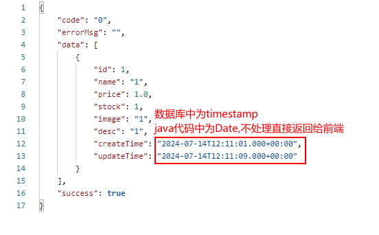
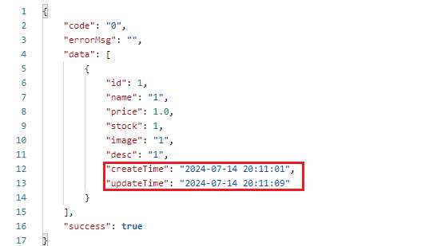

# uts-brm

---

## 1 项目简介

本项目为业务网关项目。

## 2 主要功能

主要功能为路由转发、流量控制。

## 3 实现细节

采用gateway实现。

## 4 注意事项

注意时间的配置，数据库中为timestamp类型，代码中为Date类型，直接返回给前端时，显示如下：



需要在配置文件中进行如下配置：

```properties
spring.jackson.date-format=yyyy-MM-dd HH:mm:ss
spring.jackson.time-zone=GMT+8
```

配置后，返回给前端的时间格式如下：

